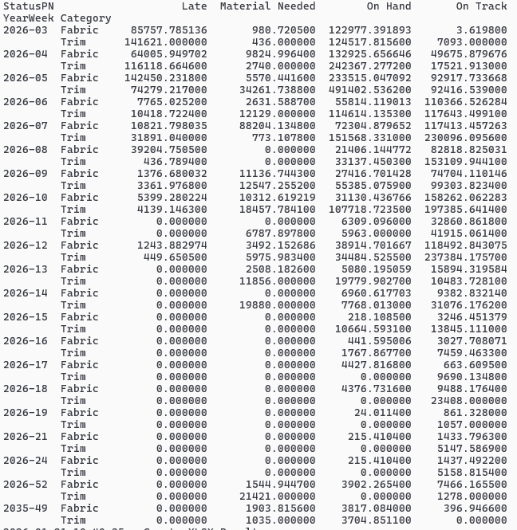

# Material Coverage Core – Cleaning and Preparing PolyPM ERP Data for Analysis (Python)
## Auxiliary Material Coverage & Data Normalization Engine for PolyPM ERP


## 1. Descripción General

**Material Coverage Core** es una solución analítica desarrollada en **Python** que funciona como un **auxiliar del ERP PolyPM**. Su propósito es evaluar la **cobertura de materiales por Part Number** frente a las necesidades reales de producción (Manufacture Orders – MOs), integrando información de inventarios, órdenes de compra y órdenes de manufactura.

> ⚠️ Importante: esta herramienta **NO reemplaza PolyPM**. No ejecuta transacciones ni modifica datos del ERP. Su función es **analítica y de apoyo a la toma de decisiones**.

---

## 2. Objetivo Técnico

Proveer un motor de cálculo externo que:

- Consolide información crítica desde PolyPM (SQL Server).
- Simule la asignación de materiales bajo múltiples escenarios.
- Entregue resultados claros, trazables y exportables para planeación y ejecución.

---

## 3. Fuentes de Información

La solución consume directamente datos desde PolyPM mediante consultas SQL:

- **Inventario**
  - On Hand
  - Inspect
  - Allocated / Forecast
  - Warehouse

- **Purchase Orders (POs)**
  - Cantidad ordenada, recibida y abierta
  - Deliveries programados
  - ETA real o simulado
  - Estatus: OnTime / Late / Complete

- **Manufacture Orders (MOs)**
  - Fecha requerida (PRD)
  - Cantidad pendiente
  - Bodega de consumo
  - Prioridad por fecha

---

## 4. Flujo General del Proceso

1. Descarga de datos desde PolyPM.
2. Normalización y preparación de DataFrames.
3. Evaluación de cobertura por **Part Number**.
4. Asignación secuencial de material a las MOs.
5. Clasificación de estatus final.
6. Generación de archivo Excel con detalle y log.

---

## 5. Lógica de Cobertura (Orden de Prioridad)

La cobertura se ejecuta siempre en el siguiente orden:

1. **Inventario On Hand – misma bodega**
2. **Inventario Inspect – misma bodega**
3. **Transferencias desde otras bodegas (On Hand / Inspect)**
4. **Purchase Orders (por ETA y Delivery disponible)**
5. **Material Needed** (cuando no existe cobertura)

---

## 6. Diagrama Funcional de Cobertura

```text
┌──────────────────────┐
│ Manufacture Order MO │
│ Pending Qty > 0      │
└─────────┬────────────┘
          │
          ▼
┌──────────────────────────────┐
│ On Hand (Same Warehouse)?    │
└───────┬──────────────────────┘
        │Yes                    │No
        ▼                       ▼
 Consume On Hand        Inspect (Same WH)?
        │                       │
        ▼                       ▼
 Pending = 0?            Consume Inspect
        │                       │
        ▼                       ▼
     COVER              Pending = 0?
                                │
                                ▼
                             COVER
                                │
                                ▼
                  Other Warehouses Available?
                                │
                                ▼
                        Suggest Transfer
                                │
                                ▼
                       Pending = 0?
                                │
                                ▼
                             COVER
                                │
                                ▼
                      Purchase Orders Available?
                                │
                                ▼
                      ETA vs PRD Validation
                                │
                                ▼
                ┌───────────────┴───────────────┐
                │                               │
            On Time                          Late
                │                               │
                ▼                               ▼
        COVER WITH PO                   OUT OF ETA
                │                               |
                ▼                               ▼
        Pending > 0 ?                   Pending > 0 ?
                │                               |
                ▼                               ▼       
        MATERIAL NEEDED                 MATERIAL NEEDED
```

---

## 7. Ejemplo Visual – 1 Part Number

### Escenario

**Part Number:** FAB-001

**Inventario Inicial:**
- WH-A: On Hand = 100
- WH-B: On Hand = 50

**Purchase Orders:**
| PO | Delivery | ETA | Status |
|----|----------|-----|--------|
| PO-1001 | 80 | 2024-10-10 | OnTime |
| PO-1002 | 60 | 2024-10-25 | Late |

**Manufacture Orders:**
| MO | PRD | Pending |
|----|-----|---------|
| MO-001 | 2024-10-05 | 60 |
| MO-002 | 2024-10-08 | 50 |
| MO-003 | 2024-10-15 | 40 |
| MO-004 | 2024-10-20 | 50 |
| MO-005 | 2024-10-30 | 40 |

---

### Paso a Paso de Cobertura

```text
Inventario Inicial:
WH-A = 100 | WH-B = 50

MO-001 (60) → WH-A On Hand
WH-A = 40
Status: COVER (On Hand)

MO-002 (50)
- WH-A: 40
- Transfer WH-B: 10
WH-A = 0 | WH-B = 40
Status: COVER (Transfer)

MO-003 (40)
- PO-1001 Delivery 40
PO-1001 Remaining = 40
Status: COVER WITH PO (On Time)

MO-004 (50)
- PO-1001 Remaining 40
- PO-1002 Delivery 10
Status: OUT OF ETA (Late PO)

MO-005 (40)
- No inventory
- No PO delivery available
Status: MATERIAL NEEDED
```

---

## 8. Resultado Final por MO

| MO | Coverage Source | Status |
|----|----------------|--------|
| MO-001 | On Hand WH-A | Cover |
| MO-002 | Transfer WH-B | Cover |
| MO-003 | PO-1001 | Cover with PO |
| MO-004 | PO-1002 | Out of ETA |
| MO-005 | None | Material Needed |

---

## 9. Beneficios Técnicos

- Lógica repetible y auditable.
- Simulación sin impacto transaccional.
- Escalable a grandes volúmenes de MOs.
- Fácil integración con reportes y dashboards.

---

## 10. Entregable del Sistema

- Archivo **Excel automático** con:
  - Detalle completo por MO
  - Estatus de cobertura
  - PO, ETA y bodega
  - Log detallado de asignación

---

## 11. Rol dentro del Ecosistema PolyPM

✔ PolyPM: sistema transaccional oficial
✔ Material Coverage Core: motor analítico auxiliar

Esta solución **extiende la capacidad de análisis del ERP** y habilita decisiones más rápidas y mejor fundamentadas para cumplir los objetivos de producción.

## Pivot de Material Coverage por StatusPN


## Keywords
PolyPM ERP, PolyPM data cleaning, PolyPM inventory analysis,
ERP data normalization, material coverage ERP,
pandas ERP, manufacturing ERP analysis